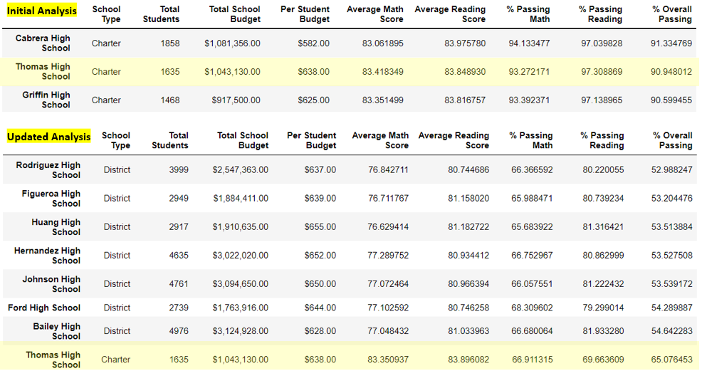

# 🚀 School_District_Analysis.
Challenge Week4 Data Analysis BootCamp using Python/ Jupyter Lab / Pandas / Numpy
## ⚡Overview of the school district analysis: 
Assist Maria the Data Scientist for a city school district, with cleaning and analyzing data of student test scores and founding. The analysis will provide an insight on how well students are performing in math and reading in comparison with their budgets. Ongoing data analysis will help student success.
The scores for the 9th graders at Thomas High School were removed because data was altered. In this summary we will compare the before and after this change and how it affected the results.
## ⚡Results:
**How is the district summary affected?**

If we compare the initial district summary with the updated one, we can see that there’s a decrease of 0.1% in the average math score, a decrease of 0.2% in the passing math percentage, a decrease of 0.3% in the passing reading percentage and finally a decrease of 0.1% in the overall percentage.

 

**How is the school summary affected?**

The scores of Thomas High School were the only ones affected. The initial passing math percentage was 93.27% and it dropped to 66.91%, the passing reading percentage was 97.30% and dropped to 69.66%, the overall passing percentage was 90.94% and dropped to 65.07%. 

**How does replacing the ninth graders’ math and reading scores affect Thomas High School’s performance relative to the other schools?**

In the initial analysis, Thomas High School was in the top school performers with an overall passing percentage of 90.94%. In the updated analysis, Thomas High School became one of the bottom school performers with a 65.07% of overall passing, that's why it's better to remove 9th graders scores and make the analysis with the rest of the school grades (10th, 11th, and 12th). With this strategy, the change is not significant and Thomas High School would remain in the top school performers.

**How does replacing the ninth-grade scores affect the following:**

**1. Math and reading scores by grade:** 

Their math and reading scores are shown as not a number. NaN isn’t a 0, it’s a null value which is empty. The rest of the data remains the same.

**2. Scores by school spending:** 

The spending range of $631 - $645 per student, at Thomas High School, remained the same and it didn’t affect the range of other schools because we made the analysis maintaining only 10th, 11th, and 12th grades. 

**3. Scores by school size:** 

The scores by school size remain the same because without the 9th graders there’s not much difference. Thomas High School grades (10th, 11th, and 12th) school size is medium, it’s between 1000-1999 students.

**4. Scores by school type:** 

The scores by school type also didn’t change because we removed the 9th grade data and maintained only 10th, 11th and 12th grades data. Thomas High School is a charter school.

## ⚡Summary:

This are the four changes in the updated school district analysis after reading and math scores for the ninth grade at Thomas High School have been replaced with NaNs:

1.	Math and reading scores of Thomas High School 9th graders cannot be compared with other schools because data is null.

2.	The district summary had a decrease of 0.1% in the overall passing percentage, it was 65% and changed to 64.9%.
3.	Thomas High School in the initial analysis was a top performer school and with the update became a bottom school performer.
4.	The 9th graders scores were removed completely, and the 10th, 11th and 12th grades were maintained to bring the data back up. Scores by school spending, size and type remain the same.

